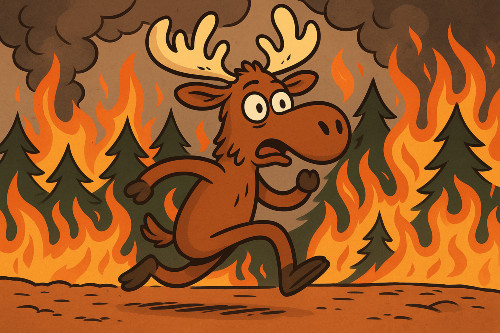

# Fuga do incêndio

<div align="center">
    
</div>


## 🫎 Introdução


## 📖 Metodologia


## 🖥️ Resultados

## 📁 Estrutura do Projeto

```bash
.
├── src/                  # Códigos-fonte (classes e funções)
│   ├── floresta.cpp
│   ├── animal.cpp
│   ├── simulacao.cpp
│   └── main.cpp
├── include/              # Arquivos de cabeçalho
│   ├── floresta.hpp
│   ├── animal.hpp
│   ├── simulacao.hpp
│   └── config.hpp
├── input.dat             # Arquivo de entrada com a floresta e posição inicial do fogo
├── output.dat            # Arquivo de saída com os estados da simulação
├── img/                  # Fotos utilizadas
│   ├── qrcode.png
│   ├── foto.jpg
├── Makefile              # Script de compilação
└── README.md             # Este arquivo
```

## 🚀 Como Executar

1. Compile e execute usando o Makefile:

```bash
make clean
make
make run
```

## 👩🏻‍💻 Autora
<p>Linkedin: www.linkedin.com/in/lorena-á-b40b03205
    
Instagram: 


</p>
