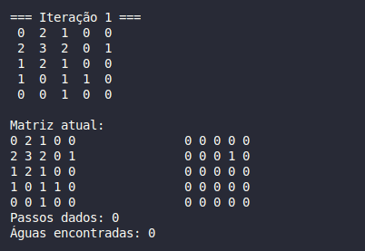
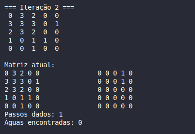
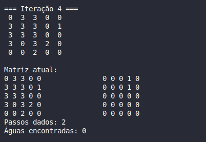
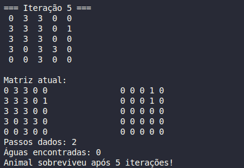

# Fuga do incêndio

<div align="center">
    
</div>


## 🫎 Introdução
<p>Neste trabalho, foi proposto desenvolver um simulador que representa a propagação de um incêndio em uma floresta e a tentativa de fuga de um animal presente nesse ambiente. A ideia é simular esse cenário em uma matriz, onde cada célula representa um tipo de terreno (como árvores, fogo, água ou áreas vazias). A cada iteração da simulação, o fogo se espalha de acordo com certas regras, e o animal precisa encontrar um caminho seguro para escapar, levando em consideração a situação ao redor.</p>


## 📁 Estrutura do Projeto

```bash
.
├── src/                  # Códigos-fonte (classes e funções)
│   ├── floresta.cpp
│   ├── animal.cpp
│   ├── simulacao.cpp
│   └── main.cpp
├── include/              # Arquivos de cabeçalho
│   ├── floresta.hpp
│   ├── animal.hpp
│   ├── simulacao.hpp
│   └── config.hpp
├── input.dat             # Arquivo de entrada com a floresta e posição inicial do fogo
├── output.dat            # Arquivo de saída com os estados da simulação
├── img/                  # Fotos utilizadas
│   ├── qrcode.png
│   ├── foto.jpg
├── Makefile              # Script de compilação
└── README.md             # Este arquivo
```


## 📖 Metodologia
### Propagação do fogo 🔥
<p>

Para montar esse simulador, começamos pensando nas duas partes principais que precisávamos controlar: a propagação do fogo e a movimentação do animal. Cada uma dessas partes foi desenvolvida em etapas para garantir que o comportamento fosse o mais próximo possível do que foi pedido no enunciado.

A primeira parte foi a criação da matriz da floresta, onde cada célula guarda um valor que representa o tipo de terreno: área vazia (0), árvore saudável (1), árvore em chamas (2), árvore queimada (3) e água (4). Essa matriz é lida de um arquivo input.dat, garantindo que diferentes cenários possam ser testados de maneira rápida.

A propagação do fogo acontece dentro da classe Floresta, no método propagarFogo(). A cada rodada, o programa verifica todas as posições da floresta: se a célula está pegando fogo (valor 2), ele tenta queimar as árvores saudáveis (valor 1) que estão nas quatro direções ortogonais (cima, baixo, esquerda e direita).

Para garantir que o fogo se propague de forma organizada, é usada uma matriz temporária. Assim, o fogo novo só aparece na floresta depois de terminar toda a verificação da rodada. No final de cada interação, as células que estavam em chamas viram árvores queimadas (valor 3).

Além da propagação normal, a simulação também permite a influência do vento, que é configurada no arquivo config.hpp. Quando o vento está ativado, ele influencia a direção em que o fogo se espalha primeiro. Por exemplo, se o vento estiver para a direita, o programa prioriza tentar queimar primeiro a posição da direita antes das outras direções.

Essa influência do vento deixa a movimentação do fogo mais dinâmica: em algumas situações, o fogo pode se espalhar mais rápido para um lado específico da floresta, mudando o jeito como o animal precisa se mover para escapar.
</p>

---

### Movimentação do animal 🐾
<p>
    
Em seguida, criamos a classe Animal, responsável por gerenciar a posição do animal na floresta. A posição do animal é controlada por duas variáveis (x e y), externas à matriz, para que o caminho dele possa ser acompanhado separadamente sem interferir nos estados do terreno. A posição inicial do animal é escolhida de forma aleatória por células 0.

Dentro do Animal, o método mover() foi pensado para tomar decisões inteligentes a cada rodada:

- Primeiro, ele verifica se há fogo nas posições vizinhas (Animal.cpp | linha 20 até 28).

- Se estiver numa área vazia (0) e o fogo não estiver perto, o animal pode ficar parado até 3 interações (tempoParado vai controlando isso).

- Se o fogo estiver ameaçando ou se ele já ficou tempo demais parado, ele precisa se mover.

Para encontrar o melhor movimento, implementamos uma busca (tipo uma pequena BFS, "Busca em Largura") para encontrar a célula mais segura possível (animal.cpp | linha 39 até o final da função):

- O animal sempre tenta ir primeiro para uma célula com água (4), porque isso é o mais seguro.

- Se não tiver água por perto, ele tenta áreas vazias (0) ou árvores saudáveis (1).

- Árvore queimada (3) é a última opção, apenas se não houver nada melhor.

A lógica de busca usa a fila std::queue<std::pair<int, int>> fila e controla as células já visitadas para evitar ficar rodando em círculo. Sempre que o animal encontra a melhor posição, ele anda um passo até lá, atualizando sua posição no caminho.

Se, mesmo tentando, o animal ficar cercado pelo fogo e for atingido, chamamos o método segundaChance(), que dá uma última oportunidade de fugir, tentando mover imediatamente de novo. Se ainda assim não tiver saída, consideramos o animal bloqueado e registramos em qual iteração isso aconteceu.

Por fim, para acompanhar tudo, criamos o método imprimirCaminhoComMatriz(), que mostra tanto a matriz da floresta quanto o caminho percorrido pelo animal, salvando também tudo isso em um arquivo de saída.
</p>

---

### Simulação 👾
<p>
Depois que tudo foi montado — floresta, fogo e animal — criamos a classe Simulacao para gerenciar todo o funcionamento do programa. Essa classe foi pensada como o "cérebro" da operação, a responsável por fazer o tempo passar dentro da floresta.

Dentro da Simulacao, implementamos o método rodar() (Simulacao.cpp | linha 9), que basicamente é um grande loop que controla o que acontece em cada iteração. A lógica desse loop é bem simples e organizada:

- Primeiro, chamamos o mover() do animal para ele tentar fugir do fogo ou procurar água (Simulacao.cpp | linha 16).

- Depois, aplicamos a propagação do fogo usando a função propagarFogo() da classe Floresta (Simulacao.cpp | linha 19).

- Depois disso, checamos se o animal foi atingido pelo fogo (com foiAtingidoPeloFogo()) ou se ele está bloqueado (sem conseguir andar pra lugar nenhum).

- No final de cada iteração, imprimimos a situação atual: mostramos a floresta na tela, o caminho que o animal já percorreu e salvamos tudo também no arquivo output.dat.

Se em algum momento o animal for bloqueado ou o fogo consumir tudo, o loop da simulação é interrompido e o programa encerra de forma segura (depois da segunda chance já ser utilizada e dentro do limite de interações).

Se o limite de interações for atingido e o animal não for bloqueado, a simulação encerra e o animal sobrevive.
</p>

---

## 🖥️ Resultados
<p>
    Para ilustrar o funcionamento da simulação, foram feitos alguns testes onde é possível acompanhar tanto a propagação do fogo quanto a movimentação do animal tentando escapar. Em cada interação, é mostrado o estado da floresta e o caminho percorrido pelo animal.
Foi utilizada a matriz:
    
```bash
5 5 1 1
0 1 1 0 0
1 2 1 0 1
1 1 1 0 0
1 0 1 1 0
0 0 1 0 0

```
O fogo começará na posição [1,1] na matriz 5X5, com o vento desligado (fogo irá se propagar nas 4 direções) e com o máximo de 5 interações.
(Foi escolhida uma matriz 5x5 apenas de exemplo para melhor vizualização!)

Após a primeira interação:



O animal se encontra na posição [3,1] e o fogo se alastra nas 4 direções.

Após a segunda interação:



O animal se encontra na posição [3,0] e o fogo se alastra nas 4 direções. Sem águas encontradas e 1 passo dado.

Após a terceira interação:


O animal permanece na posição.

Após a quarta interação:



O animal permanece na posição e o fogo não tem mais para onde se espalhar.

Após a quinta interação:



O animal sobrevive no fim da simulação e realizou apenas 2 passos.

Foi verificado que a simulação acontece de forma correta (outros exemplos de matriz foram testados e todos os requisitos foram atendidos).

</p> 

---

## 📊 Conclusão

<p>
A simulação conseguiu representar bem a movimentação do animal e o avanço do fogo dentro da floresta, seguindo as regras que foram estabelecidas. A cada rodada, deu pra perceber que o crescimento do fogo acontece de forma muito rápida e exponencial: uma vez iniciado, ele vai tomando proporções cada vez maiores, já que a cada interação ele se espalha para várias árvores saudáveis ao redor, multiplicando sua área afetada.

Mesmo com a tentativa do animal de fugir buscando áreas seguras ou água, nem sempre é possível escapar, principalmente quando o fogo cerca muitas direções ao mesmo tempo. Isso mostra como o comportamento do incêndio é difícil de controlar sem uma intervenção externa mais forte.

Apesar de o sistema funcionar bem para o que foi proposto, algumas melhorias poderiam deixar a simulação ainda mais interessante e realista. Por exemplo:

- Poderia ser implementado um sistema mais inteligente de movimentação do animal, talvez usando algoritmos de caminho mínimo (como Dijkstra ou A*), para ele planejar rotas melhores.
    
</p>

--- 

## Referências 

<p>
    
- Biblioteca < iostream >
Utilizada para entrada e saída de dados no console, permitindo a impressão da matriz, do caminho do animal, e informações gerais da simulação.
    
- Biblioteca < fstream >
Utilizada para leitura de dados de arquivos (input.dat) e gravação dos resultados em um arquivo de saída (output.dat).

- Biblioteca < vector >
Usada para criar e manipular as matrizes da floresta e do caminho do animal de maneira dinâmica.

- Biblioteca < queue >
Aplicada na implementação da movimentação do animal, utilizando busca em largura (BFS) para encontrar rotas seguras.

- Biblioteca < utility >
Utilizada para manipular pares de valores (std::pair<int, int>) representando coordenadas na matriz.

- Biblioteca < string >
Usada para manipular cadeias de caracteres, como nomes de arquivos e mensagens de texto.

- Biblioteca < cstdlib >
Utilizada para gerar valores aleatórios, principalmente na escolha da posição inicial do animal em locais seguros.

- Biblioteca < ctime >
Utilizada para inicializar o gerador de números aleatórios (srand(time(0))), garantindo que a aleatoriedade varie a cada execução do programa.

- Biblioteca < algorithm >
Usada para operações de manipulação de dados, como encontrar elementos em vetores ou fazer cópias e modificações.

- Biblioteca < iomanip >
Utilizada para controlar a formatação de saída, como alinhamento e espaçamento entre elementos impressos no console.

- Linguagem C++
Todo o projeto foi desenvolvido em C++, aproveitando recursos de orientação a objetos, manipulação eficiente de dados e velocidade de execução.

</p>

---

## 🚀 Como Executar

1. Compile e execute usando o Makefile:

```bash
make clean
make
make run
```

## 👩🏻‍💻 Autora
<p>Lorena Ávila
    
Linkedin: www.linkedin.com/in/lorena-á-b40b03205
    
Instagram: 


</p>
